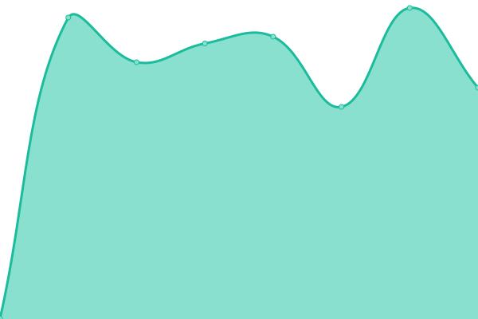
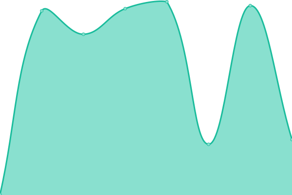
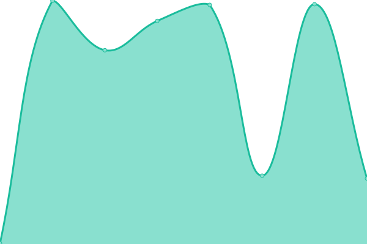
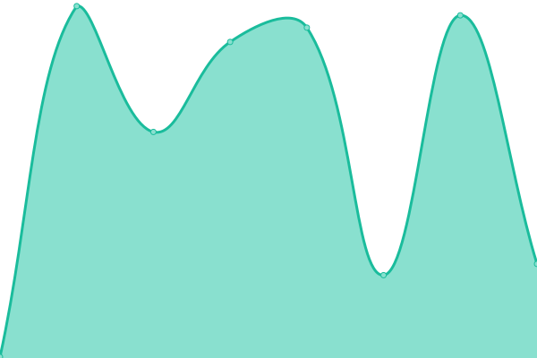

# [📈 Live Status](https://shokworks.github.io/upptime): <!--live status--> **🟧 Partial outage**

This repository contains the open-source uptime monitor and status page for [Shokworks](https://shokworks.github.io/upptime), powered by [Upptime](https://github.com/upptime/upptime).

With [Upptime](https://upptime.js.org), you can get your own unlimited and free uptime monitor and status page, powered entirely by a GitHub repository. We use [Issues](https://github.com/shokworks/upptime/issues) as incident reports, [Actions](https://github.com/shokworks/upptime/actions) as uptime monitors, and [Pages](https://shokworks.github.io/upptime) for the status page.

<!--start: status pages-->
<!-- This summary is generated by Upptime (https://github.com/upptime/upptime) -->
<!-- Do not edit this manually, your changes will be overwritten -->
<!-- prettier-ignore -->
| URL | Status | History | Response Time | Uptime |
| --- | ------ | ------- | ------------- | ------ |
|  [Shokworks](https://shokworks.io) | 🟩 Up | [shokworks.yml](https://github.com/shokworks/upptime/commits/HEAD/history/shokworks.yml) | 

 636ms
     
 | 

<a href="https://shokworks.github.io/upptime/history/shokworks">100.00%</a>
    

|  [Mira App](https://app.miraapp.io) | 🟩 Up | [mira-app.yml](https://github.com/shokworks/upptime/commits/HEAD/history/mira-app.yml) | 

 249ms
     
 | 

<a href="https://shokworks.github.io/upptime/history/mira-app">100.00%</a>
    

|  [Metrocrowd Beta](https://app-beta.metrocrowd.io) | 🟩 Up | [metrocrowd-beta.yml](https://github.com/shokworks/upptime/commits/HEAD/history/metrocrowd-beta.yml) | 

 288ms
     
 | 

<a href="https://shokworks.github.io/upptime/history/metrocrowd-beta">100.00%</a>
    

|  [API Metrocrowd Beta](https://api-beta.metrocrowd.io/api/docs/) | 🟩 Up | [api-metrocrowd-beta.yml](https://github.com/shokworks/upptime/commits/HEAD/history/api-metrocrowd-beta.yml) | 

 195ms
     
 | 

<a href="https://shokworks.github.io/upptime/history/api-metrocrowd-beta">100.00%</a>
    

|  [Metrohouse Beta](https://app-beta.metrohouse.io) | 🟩 Up | [metrohouse-beta.yml](https://github.com/shokworks/upptime/commits/HEAD/history/metrohouse-beta.yml) | 

 243ms
     
 | 

<a href="https://shokworks.github.io/upptime/history/metrohouse-beta">100.00%</a>
    

|  [Test Broken Site](https://thissitedoesnotexist.koj.co) | 🟥 Down | [test-broken-site.yml](https://github.com/shokworks/upptime/commits/HEAD/history/test-broken-site.yml) | 

 0ms
     
 | 

<a href="https://shokworks.github.io/upptime/history/test-broken-site">100.00%</a>
    

<!--end: status pages-->

[**Visit our status website →**](https://shokworks.github.io/upptime)

## 📄 License

- Powered by: [Upptime](https://github.com/upptime/upptime)
- Code: [MIT](./LICENSE) © [Shokworks](https://shokworks.github.io/upptime)
- Data in the `./history` directory: [Open Database License](https://opendatacommons.org/licenses/odbl/1-0/)
